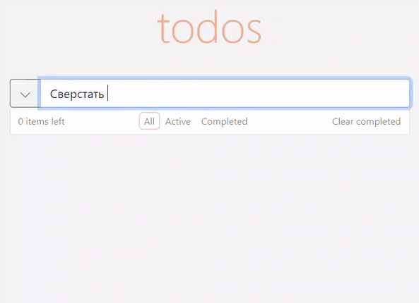

<!-- ToDo-приложение на React (хуки) + Redux, позволяющее управлять текущим списком дел.  
В интерфейсе присутствует:
 - Поле для ввода новой задачи.
 - Списки всех задач, невыполненных и выполненных задач (по отдельности).
 - Фильтры выполненных и невыполненных задач.
 - Удаление выполненных задач одной кнопкой.
 - Счетчик невыполненных задач.    
Доп библиотеки: Bootstrap, react-bootstrap, React-Transition-Group, react-icons. -->

# SPA ToDo-приложение на React (хуки) + Redux, позволяющее управлять текущим списком дел.

## Запуск: *npm start*

___

## В интерфейсе присутствует:
- Поле для ввода новой задачи.
 - Списки всех задач, невыполненных и выполненных задач (по отдельности).
 - Фильтры выполненных и невыполненных задач.
 - Удаление выполненных задач одной кнопкой.
 - Счетчик невыполненных задач.
### Доп библиотеки: *react-bootstrap, React-Transition-Group, react-icons.*
___

### Добавить todo в список можно кликом по кнопке слева от поля ввода, а так же кнопкой Enter.

